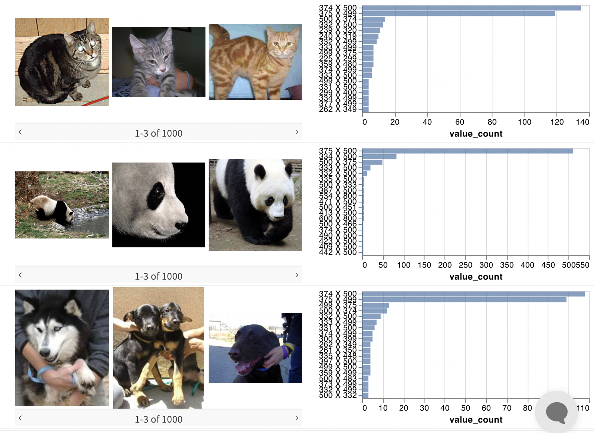
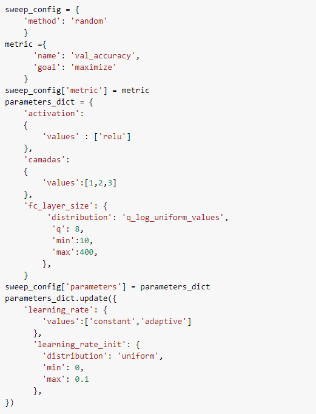

# Model Card

Model cards are a succinct approach for documenting the creation, use, and shortcomings of a model. The idea is to write a documentation such that a non-expert can understand the model card's contents. For additional information see the Model Card paper: https://arxiv.org/pdf/1810.03993.pdf

## Model Details
Matheus Santos and Igor Veríssimo created the model. A complete data pipeline was built using Google Colab, Scikit-Learn and Weights & Bias to train a KNN and MLP model. The big-picture of the data pipeline is shown below:

## Intended Use
This model is used as a proof of concept for the evaluation of an entire data pipeline incorporating Machine Learning fundamentals. The data pipeline is composed of the following stages: a) ``fetch data``, b) ``preprocess``, c) <s>``check data``</s>, d) ``segregate``, e) ``train`` and f) ``test``.

## Training Data

The purpose of this dataset is to correctly classify an image as containing a dog, cat, or panda. Containing only 3,000 images, the Animals dataset is meant to be another **introductory** dataset
that we can quickly train a KNN model and obtain initial results (no so good accuracy) that has potential to be used as a baseline. 

After the EDA stage of the data pipeline, it was noted that the images in training data has different resolutions. A pre-processing stage is necessary in order to normalize all images using the same size. 

## Tune Hyperparameters
We use Weights & Biases Sweeps to automate hyperparameter search and explore the space of possible models to our MLP model. Sweeps combines the benefits of automated hyperparameter search with our visualization-rich, interactive experiment tracking. Pick from popular search methods such as Bayesian, grid search, and random to search the hyperparameter space. Our sweep configuration is shown below:

## Evaluation Data
The dataset under study is split into Train and Test during the ``Segregate`` stage of the data pipeline. 70% of the clean data is used to Train and the remaining 30% to Test. 

## Metrics
In order to follow the performance of machine learning experiments, the project marked certains stage outputs of the data pipeline as metrics. The metrics adopted are: [accuracy](https://scikit-learn.org/stable/modules/generated/sklearn.metrics.accuracy_score.html), [f1](https://scikit-learn.org/stable/modules/generated/sklearn.metrics.f1_score.html#sklearn.metrics.f1_score), [precision](https://scikit-learn.org/stable/modules/generated/sklearn.metrics.precision_score.html#sklearn.metrics.precision_score), [recall](https://scikit-learn.org/stable/modules/generated/sklearn.metrics.recall_score.html#sklearn.metrics.recall_score).

To calculate the evaluations metrics is only necessary to run:

The follow results will be shown:

 **Algorithm**  |  **Stage [Run]**                        | **Accuracy** | **F1** | **Precision** | **Recall** | 
----------------|---------------------------------|--------------|--------|---------------|------------|
 KNN    | [sage-sweep-1](https://wandb.ai/igordias/first_image_classifier/runs/hwmqlxko/overview) | 0.4693      | 0.4736 | 0.5418        | 0.4693    |  
 MLP     | [test177](https://wandb.ai/igordias/classifier_mlp/runs/cq2riglj/overview?workspace=user-igordias)  | 0.612      | 0.6123 | 0.6175        | 0.612     |

## Ethical Considerations

We may be tempted to claim that this dataset contains the only attributes capable of predicting if there is a cat, dog or a panda in an image. However, this is not the case. The dataset is composed of 3,000 images, which is a small number of images to train a model. The dataset is also composed of images with different resolutions, which may lead to a model that is not robust to different image sizes.

## Caveats and Recommendations
It should be noted that the model trained in this project was used only for validation of a complete data pipeline. It is notary that some important issues related to size of images exist, and adequate techniques need to be adopted in order to balance it. Including data augmentation techniques, for example. Other more appropriate models should be used in order to obtain better results such as Convolutional Neural Networks (CNNs).

## References
- [Ivanovitch's repository](https://github.com/ivanovitchm/embedded.ai)
