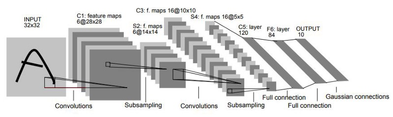
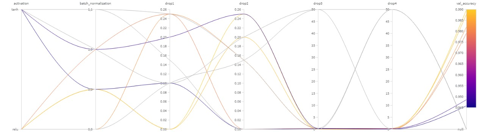
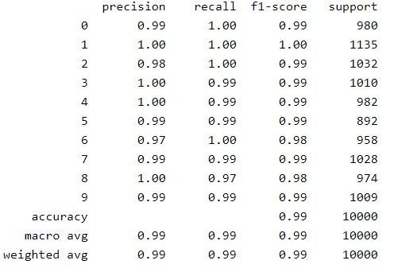
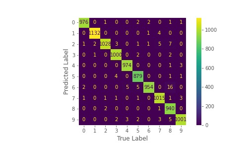

# LeNet-5
Perhaps the first widely known and successful application of convolutional neural networks was LeNet-5, described by Yann LeCun, et al. in their 1998 paper titled [Gradient-Based Learning Applied to Document Recognition](https://ieeexplore.ieee.org/document/726791). The system was developed for use in a handwritten character recognition problem and demonstrated on the MNIST standard dataset, achieving approximately 99.2% classification accuracy (or a 0.8% error rate). The network was then described as the central technique in a broader system referred to as Graph Transformer Networks.

It is a long paper, and perhaps the best part to focus on is Section II. B. that describes the LeNet-5 architecture. In that section, the paper describes the network as having seven layers with input grayscale images having the shape 32 x 32, the size of images in the MNIST dataset. You can see the architecture figure below.

The modified model was developed by Matheus Santos and [Igor Dias](https://github.com/IgorDiasV). In our model, we added dropout and batch normalization concepts.

## Training Data

The MNIST database contains 60,000 training images and 10,000 testing images. Half of the training set and half of the test set were taken from NIST's training dataset, while the other half of the training set and the other half of the test set were taken from NIST's testing dataset. The original creators of the database keep a list of some of the methods tested on it. In their original paper, they use a support-vector machine to get an error rate of 0.8%.

## Tune Hyperparameters
We use Weights & Biases Sweeps to automate hyperparameter search and explore the space of possible models to our <strong>LeNet-5 model</strong>. Sweeps combines the benefits of automated hyperparameter search with our visualization-rich, interactive experiment tracking. Pick from popular search methods such as Bayesian, grid search, and random to search the hyperparameter space. Our sweep configuration is shown below:

*  `activation`: activation functions. The possibilities are: tanh, relu;
*  `batch_normalization`: tuple configuration to first and second convolutional layers. The configurations are: (0,0), (0,1), (1,0), (1,1);
*  `drop1`: nodes in the first convolutional layer to be dropped with a given probability. The possibilities are: 0, 0.10, 0.15, 0.20, 0.25;
*  `drop2`: nodes in the second convolutional layer to be dropped with a given probability. The possibilities are: 0, 0.10, 0.15, 0.20, 0.25;
*  `drop3`: nodes in the first FC layer to be dropped with a given probability. The possibilities are: 0, 0.25, 0.40, 0.50;
*  `drop4`: nodes in the second FC layer to be dropped with a given probability. The possibilities are: 0, 0.25, 0.40, 0.50;

## Best Architecture Configuration
After a random exploration of 10 runs, the following sweep configuration was arrived at for the best LeNet-5 model with <strong>99% validation accuracy</strong>:

*  `activation`: relu;
*  `batch_normalization`: (0,1);
*  `drop1`: 0;
*  `drop2`: 0.25;
*  `drop3`: 0;
*  `drop4`: 0;

## Metrics
In order to follow the performance of machine learning experiments, the project marked certains stage outputs of the data pipeline as metrics. The metrics adopted are: [accuracy](https://scikit-learn.org/stable/modules/generated/sklearn.metrics.accuracy_score.html), [f1](https://scikit-learn.org/stable/modules/generated/sklearn.metrics.f1_score.html#sklearn.metrics.f1_score), [precision](https://scikit-learn.org/stable/modules/generated/sklearn.metrics.precision_score.html#sklearn.metrics.precision_score), [recall](https://scikit-learn.org/stable/modules/generated/sklearn.metrics.recall_score.html#sklearn.metrics.recall_score).

To calculate the evaluations metrics is only necessary to run:

The follow results will be shown:

  **Stage [Run]**                        | **Accuracy** | **F1** | **Precision** | **Recall** | 
---------------------------------|--------------|--------|---------------|------------|
[usual-sweep-6](https://wandb.ai/igordias/lenet-modificada2/runs/p9ylu14c) | 0.99      | 0.99 | 0.99        | 0.99    |  
[pleasant-sweep-1](https://wandb.ai/igordias/lenet-modificada2/runs/zgy6qq1b)  | 0.98      | 0.98 | 0.98        | 0.98     |
[youthful-sweep-3](https://wandb.ai/igordias/lenet-modificada2/runs/xxwg7s75)  | 0.98      | 0.98 | 0.98        | 0.98     |
[silvery-sweep-2](https://wandb.ai/igordias/lenet-modificada2/runs/aswl20fi)  | 0.96      | 0.96 | 0.96        | 0.96     |
[balmy-sweep-4](https://wandb.ai/igordias/lenet-modificada2/runs/qw6yciw8)  | 0.96      | 0.96 | 0.96        | 0.96     |
[stellar-sweep-5](https://wandb.ai/igordias/lenet-modificada2/runs/fkn28ie1)  | 0.96      | 0.96 | 0.96        | 0.96     |
[astral-sweep-7](https://wandb.ai/igordias/lenet-modificada2/runs/2ycxsvix)  | 0.95      | 0.95 | 0.95        | 0.95     |
[devoted-sweep-8](https://wandb.ai/igordias/lenet-modificada2/runs/vunwi7di)  | 0.95      | 0.95 | 0.95        | 0.95     |
[gallant-sweep-9](https://wandb.ai/igordias/lenet-modificada2/runs/cf5xh31j)  | 0.95      | 0.95 | 0.95        | 0.95     |
[iconic-sweep-10](https://wandb.ai/igordias/lenet-modificada2/runs/w5v4uq4j)  | 0.95      | 0.95 | 0.95        | 0.95     |

The figure below shows the results reached by exploration space of possible models to our LeNet-5 models.

Here's our classification report and confusion matrix, respectively:

## References
- [Ivanovitch's repository](https://github.com/ivanovitchm/embedded.ai)
