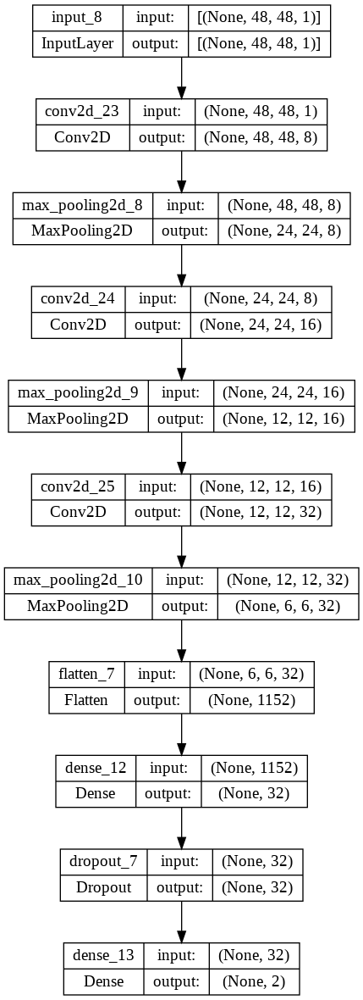
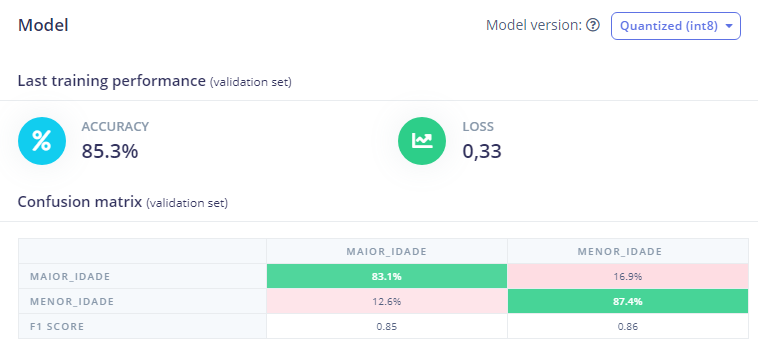

# Underage classifier

## Context/Goal
Computer vision is a field of artificial intelligence (AI) that enables computers and systems to derive meaningful information from digital images, videos, and other visual inputs—and take actions or make recommendations based on that information. If AI lets computers think, computer vision lets them see, observe, and understand.

In this sense, we will use computer vision to infer whether the person in the image is of legal age or underage.

An example of an application that we could use our artificial intelligence would be for facial recognition of people under 18 years old, in order to restrict their access to inappropriate places for their age. For example: clubs, bars, etc.

## Requirements
The technologies used for the development of this project were:
- Arduino_OV767X 0.0.1;
- Harvard_TinyMLx 1.2.2-Alpha;
- Arduino_TensorFlowLite 1.15.0-Alpha.

## Dataset
The dataset was taken from Kaggle [“Age, gender and ethnicity”](https://www.kaggle.com/datasets/nipunarora8/age-gender-and-ethnicity-face-data-csv). This dataset includes a CSV of facial images labeled based on age, gender, and ethnicity. The dataset includes 23705 rows and 5 columns, namely:

- age: person's age;
- ethnicity: specifies the person's ethnicity;
- gender: person's gender;
- img_name: image name;
- pixels: pixels of grayscale face images.

Up to 1-17 years old, 50 images of each age were collected. Proportionally, between 18-116 years old, 10 images were collected for each age, in order to increase the representativeness and balance of the data. The data looked like this:

- underage: 1-17 years old, 694 exemplaries;
- of legal age: 18-116 years old, 698 exemplaries.

The training set includes 1392 samples (around 80%). While for the validation set they consist of 346 samples (around 20%).

## Model
The model was built on the Edge Impulse platform and the 2D convolutional network was chosen. The architecture of the model can be seen below:

Different pre-trained models made available by the Edge Impulse platform were tested, such as MobileNetV1 and MobileNetV2, however, at the end of the training, the models exceeded the maximum amount of RAM of the Arduino Nano 33 BLE Sense (298 KB).

## Parameters
The training parameters were:
- epochs: 50;
- learning rate: 0.0005.

## Results

## Step by step

## References
- [Ivanovitch's repository](https://github.com/ivanovitchm/embedded.ai)
- [Marcelo's repositority](https://github.com/Mjrovai/UNIFEI-IESTI01-TinyML-2022.1)
- [Edge Impulse](https://www.edgeimpulse.com/)